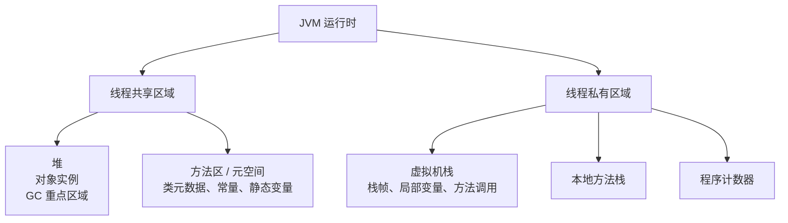
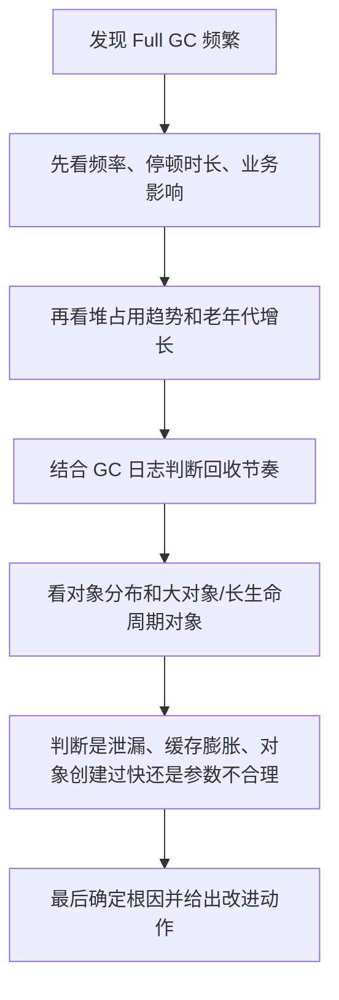

# JVM面试题库

## 模块导航

- `1. JVM 基础与运行时结构`：先建立 JVM 运行机制、内存分区和核心概念认知。
- `2. Java 内存模型与可见性`：重点理解 JMM、可见性、有序性、原子性和 happens-before。
- `3. GC 与垃圾回收器`：重点回答 GC 基础、常见回收器和调优方向。
- `4. JVM 线上排查与调优`：重点回答 Full GC、内存问题和线上 JVM 排查思路。

## 总目录

- `1.1` JVM 运行时内存结构怎么理解？
- `1.2` 堆、栈、方法区分别放什么？
- `1.3` JVM、JRE、JDK 三者怎么理解？
- `1.4` 类加载过程怎么理解？
- `2.1` 什么是 Java 内存模型 JMM？
- `2.2` 可见性、有序性、原子性怎么理解？
- `2.3` happens-before 怎么理解？
- `2.4` JMM 和 JVM 内存结构有什么区别？
- `3.1` 什么是 GC？为什么要有 GC？
- `3.2` 常见垃圾回收器怎么理解？
- `3.3` Minor GC、Major GC、Full GC 怎么区分？
- `3.4` Full GC 频繁一般怎么排查？
- `4.1` JVM 线上问题一般怎么看？
- `4.2` 内存泄漏和内存溢出有什么区别？
- `4.3` CPU 高、内存高、RT 抖动时，JVM 角度一般怎么看？

## 一页速记

- JVM 运行时内存结构讲“怎么分区”，JMM 讲“并发下怎么可见、怎么有序”。
- 对象大多在堆里，方法调用信息在栈里，类元数据通常看方法区或元空间。
- `volatile` 解决可见性和部分有序性，不解决复合操作原子性。
- happens-before 不是简单“先后顺序”，而是“前面的结果对后面可见”的规则。
- GC 的核心代价是停顿和资源消耗，回收器本质上是在吞吐量和停顿之间做取舍。
- Full GC 频繁先看趋势，再看堆和对象分布，不要一上来就猜泄漏。
- CPU 高先看线程，内存高先看堆，RT 抖动先看 GC 和阻塞。
- JVM 问题排查最怕直接拍结论，最稳的是“现象 -> 指标 -> 线程/堆/GC -> 根因”。

## 高频易混点

- `JVM 运行时内存结构` 和 `JMM` 不是一回事：前者讲内存分区，后者讲并发语义。
- `内存泄漏` 和 `内存溢出` 不是同义词：泄漏更像原因，溢出更像结果。
- `volatile` 不能解决复合操作原子性，它主要解决可见性和部分有序性问题。
- `Major GC` 在不同资料里的口径不完全统一，复习时优先抓“回收范围”和“业务影响”，不要死抠名词。
- `方法区` 和 `元空间` 是概念演进关系，学习时重点理解“类元数据放在哪里”，不要被术语切换带偏。

## 关键对比表

### JMM 和 JVM 运行时内存结构

| 对比项  | JVM 运行时内存结构          | JMM                        |
| ---- | -------------------- | -------------------------- |
| 核心问题 | 内存怎么分区               | 多线程下共享变量怎么可见、怎么有序          |
| 关注点  | 堆、栈、方法区、程序计数器等区域     | 可见性、有序性、原子性、happens-before |
| 常见追问 | 对象放哪、栈为什么会溢出、GC 主要看哪 | `volatile`、锁、重排序、并发语义      |
| 常见误区 | 把方法区当成“方法代码区”        | 把 JMM 当成“另一块内存区域”          |

### `volatile`、`synchronized`、CAS

| 对比项         | `volatile` | `synchronized` | CAS                |
| ----------- | ---------- | -------------- | ------------------ |
| 主要解决        | 可见性、部分有序性  | 可见性、互斥、原子性     | 无锁更新下的原子性          |
| 能否保证复合操作原子性 | 否          | 是              | 单次 CAS 可以，复杂逻辑仍要小心 |
| 代价          | 轻量         | 可能阻塞和上下文切换     | 可能自旋重试             |
| 典型场景        | 状态标志位、配置开关 | 临界区保护          | 原子类、并发计数更新         |

### 常见垃圾回收器

| 回收器      | 主要特点          | 更适合的目标       |
| -------- | ------------- | ------------ |
| Serial   | 简单、单线程、停顿明显   | 小堆、简单场景、学习理解 |
| Parallel | 更偏吞吐量         | 批处理、后台任务     |
| CMS      | 低停顿思路明显，但实现复杂 | 对停顿敏感的老服务场景  |
| G1       | 更均衡、服务端常见     | 在线业务、兼顾吞吐和停顿 |

### JVM 问题排查入口

| 现象    | 第一观察点          | 常见方向                   |
| ----- | -------------- | ---------------------- |
| CPU 高 | 热点线程、线程栈       | 死循环、自旋、GC 抢 CPU、热点代码   |
| 内存高   | 堆占用、对象增长趋势     | 缓存膨胀、对象积压、泄漏、参数过小      |
| RT 抖动 | GC 日志、线程阻塞、线程池 | Full GC、锁竞争、下游变慢、线程池堆积 |

## 最小工具链

| 工具       | 最常用来干什么        | 学习时先记什么                      |
| -------- | -------------- | ---------------------------- |
| `jps`    | 看当前有哪些 Java 进程 | 先定位要排查的 Java 进程号             |
| `jstat`  | 看 GC 和堆变化趋势    | 先学会判断 Full GC 是否频繁、老年代是否持续上涨 |
| `jstack` | 看线程栈           | 适合排 CPU 高、死锁、线程阻塞            |
| `jmap`   | 看堆信息、导出 dump   | 适合排内存高、对象分布异常、OOM            |

## 从症状倒推

- 看到 `CPU 高`：
  先想热点线程、死循环、自旋、频繁 GC，不要一上来先怀疑数据库。
- 看到 `内存高`：
  先分清是短期峰值还是持续上涨，再判断更像流量峰值、缓存膨胀还是内存泄漏。
- 看到 `RT 抖动`：
  先看 GC 日志和线程阻塞，再看线程池、锁竞争和下游调用，不要只盯 JVM 参数。
- 看到 `频繁 Full GC`：
  先看堆占用趋势和老年代增长，再看对象分布、缓存、集合、参数配置和泄漏风险。

## 关键图示

### JVM 运行时内存结构图

### 类加载流程图

### Full GC 排查流程图

## JVM 实战案例

### 案例 1：服务 CPU 飙高怎么排

- 现象：
  服务 CPU 持续接近 100%，但流量没有明显上涨。
- 排查顺序：
  先用 `jps` 找到进程，再用 `jstack` 找热点线程，确认是不是死循环、自旋、锁竞争或 GC 抢占 CPU。
- 常见结论：
  很多问题最后不是 JVM 参数本身，而是某段业务代码空转、自旋锁竞争，或者对象创建太快导致 GC 抢 CPU。

### 案例 2：内存持续上涨最终 OOM

- 现象：
  堆使用率持续上涨，重启后恢复，运行一段时间又涨回去。
- 排查顺序：
  先看这是短期峰值还是长期趋势，再用 `jstat` 看堆变化，用 `jmap` 或 dump 看对象分布，重点怀疑缓存、集合、`ThreadLocal`、监听器持有。
- 常见结论：
  如果对象一直留在内存里不掉，往往更像泄漏；如果只是某个时间点突然冲高，也可能是流量峰值或大对象分配问题。

### 案例 3：接口 RT 周期性抖动

- 现象：
  接口平均响应时间正常，但 P99 周期性抖高。
- 排查顺序：
  先看 GC 日志和停顿时间，再看线程池、锁等待和下游依赖耗时，判断是 Full GC、阻塞还是外部调用问题。
- 常见结论：
  这类问题很容易误判成“JVM 不行”，但真实场景里经常是 Full GC、线程池堆积和慢依赖共同造成的。

### 案例 4：Full GC 频繁但找不到明显泄漏

- 现象：
  Full GC 次数很多，但 dump 看不出非常典型的泄漏对象。
- 排查顺序：
  先看对象是不是创建过快、生命周期是不是异常、老年代是否被缓存或大集合长期占住，再看参数是不是不匹配当前流量模型。
- 常见结论：
  Full GC 频繁不一定就是“代码泄漏”，也可能是对象晋升过快、缓存策略不合理或参数配置过小。

### 案例 5：一次更完整的排障复盘

- 现象：
  某个在线接口白天偶发超时，P99 明显抖高，业务层最初怀疑是下游服务不稳定。
- 排查过程：
  先看监控发现 RT 抖动和 Full GC 时间点基本重合，再用 `jstat` 观察到老年代持续上涨；继续结合 GC 日志和堆分析，发现大批缓存对象生命周期过长，回收效果很差。
- 最终根因：
  某段缓存策略设计不合理，短期热点对象被长时间保留，导致老年代压力增大，最终把问题放大成 Full GC 抖动。
- 改进动作：
  缩短不必要的缓存生命周期，收紧对象大小和数量监控，同时把 Full GC 频率、停顿时间和老年代使用率做成长期告警。

# 1. JVM 基础与运行时结构

## 本模块题目

- `1.1` JVM 运行时内存结构怎么理解？
- `1.2` 堆、栈、方法区分别放什么？
- `1.3` JVM、JRE、JDK 三者怎么理解？
- `1.4` 类加载过程怎么理解？

## 知识地图

- `JVM 基础与运行时结构 -> 关键概念 -> 典型场景 -> 常见误区 -> 工程实践`

## 学习目标

- 理解“JVM 基础与运行时结构”这组内容的主线，而不是零散背诵单个题目。
- 能把核心概念、适用场景和工程边界连起来表达。
- 能把这一组知识和上下游模块串成完整链路。

## 先修知识

- Java 基础
- 对象与类
- 线程基础

## 本模块总结

- 这一组最容易混的，是把“JVM 运行时内存结构”和 “JMM” 混在一起，它们不是一层问题。
- 这一组真正要抓住的主线，是对象、方法调用、类元数据分别落在哪些区域，以及这些区域为什么会和后面的 GC、类加载、异常类型对应起来。
- 如果你能把“堆 / 栈 / 方法区”和常见异常、常见线上现象连起来，这一组就不再只是概念背诵。

## 典型业务场景

- 排查 `StackOverflowError` 时，为什么第一反应会想到递归过深和栈帧过多。
- 一个服务频繁报 `Java heap space` 时，为什么要先看堆对象增长，而不是先怀疑类加载。
- 使用大量动态代理、反射或热加载时，为什么元空间也可能成为问题点。

## 最小实践建议

- 先手画一张 JVM 运行时内存结构图，强制区分线程共享和线程私有区域。
- 再把 `OOM`、`SOF`、类加载相关问题分别挂到堆、栈、方法区或元空间上，练习建立“区域 -> 现象”映射。

## 1.1 JVM 运行时内存结构怎么理解？

### 核心讲解

- JVM 运行时常见可以从线程共享和线程私有两条线理解：堆和方法区更偏共享，虚拟机栈、本地方法栈和程序计数器更偏线程私有。
- 堆主要放对象实例，是 GC 的重点区域。
- 栈主要放局部变量、方法调用信息。
- 方法区主要放类元信息、常量、静态变量等。

### 深入理解

- 这题的关键不是把几个内存区域名字背下来，而是先分清“线程私有”和“线程共享”两类区域。只要这个大框架清楚，后面的 GC、栈溢出、类元数据、线程安全问题都会更容易理解。
- 真正容易混的是：JVM 运行时内存结构讲的是“内存怎么分区”，JMM 讲的是“多线程下共享变量怎么可见、怎么有序”，两者名字都带内存，但不是一回事。
- 工程上为什么这题重要？因为很多线上问题最后都会落回具体区域，比如 `StackOverflowError` 往往看栈，`OutOfMemoryError: Java heap space` 往往看堆，类加载过多或动态代理太多时又可能落到方法区或元空间。
- 学透这题以后，再看“堆栈方法区放什么”“GC 为什么主要盯堆”“类加载为什么影响元空间”，会形成一条完整主线。

### 追问答案

- 为什么大部分对象在堆里？
  因为堆是线程共享区域，更适合统一管理对象生命周期。

### 学习提示

- 复习时先画一个最简版 JVM 内存图，把“线程共享 / 线程私有”标出来。
- 这题最好和 `1.2`、`2.4` 一起看，专门练习区分“运行时分区”和“并发内存语义”。

---

## 1.2 堆、栈、方法区分别放什么？

### 核心讲解

- 堆放对象，栈放方法调用帧和局部变量，方法区放类元数据和常量池。
- 面试里这题重点不是死背区域名，而是能说清“对象在哪里、方法调用在哪里、类信息在哪里”。

### 深入理解

- 这题最容易答空，真正要把“存什么”说成“为什么放那里”。对象之所以主要放堆，是因为它们生命周期由 GC 统一管理；方法调用信息放栈，是因为它天然跟线程执行路径绑定；类元数据放方法区，是因为类通常要被多个对象和线程共享。
- 还要注意一个常见误区：方法区不是“方法代码区”这么简单，它更偏类相关元数据区域。JDK 8 之后很多资料也会直接把它和元空间一起讲，这时要知道概念对应关系，不要死扣术语。
- 这题和线上故障也能直接连起来。比如递归过深更容易栈溢出，大对象和对象暴涨更容易撑满堆，类动态生成过多可能把元空间打满。
- 如果你能把“对象、调用、类信息”分别挂到堆、栈、方法区上，再顺手说出对应的典型错误，这题就已经不只是定义题了。

### 追问答案

- 栈溢出一般对应什么？
  通常和递归过深或栈帧过大有关。

### 学习提示

- 这题适合和常见异常一起记：堆更容易联想到 OOM，栈更容易联想到 SOF，方法区更容易联想到类元数据膨胀。
- 面试时不要只报名词，尽量补一句“为什么会放在这里”。

---

## 1.3 JVM、JRE、JDK 三者怎么理解？

### 核心讲解

- JVM 是运行 Java 字节码的虚拟机，JRE 是运行环境，JDK 是开发工具包，包含 JRE 和编译调试工具。
- JVM 负责真正执行字节码。
- JRE 提供运行 Java 程序所需的基础环境。
- JDK 在 JRE 基础上，再提供 `javac`、`jps`、`jstack` 这类开发和排查工具。

### 深入理解

- 这题本身不深，但它是 JVM 相关问题的一个入口。真正要会的是：JDK 偏开发工具链，JRE 偏运行环境，JVM 只是真正执行字节码的那一层。
- 很多人会把这三个概念讲得太散，最稳的办法是从外到内理解：JDK 包住 JRE，JRE 再包住 JVM。这样不仅好记，也方便顺着往下讲到编译、运行、排障工具。
- 工程上这题的价值在于它能自然引出 `javac`、`jps`、`jstack`、`jmap` 这些工具，它们都属于“JDK 提供的能力”，而不是 JVM 本身自带一个命令行让你直接操作。
- 如果面试官顺着问，你可以继续衔接到“Java 程序从源码到字节码再到 JVM 执行”的链路，这样答案会更完整。

### 追问答案

- 面试里为什么会问这个？
  因为它能顺带引出类加载、运行时和排查工具这些后续问题。

### 学习提示

- 这题不需要讲太久，但要讲得有层次，别把三个词说成同义词。
- 最好顺手连到“开发工具在 JDK、运行依赖 JRE、执行靠 JVM”这条线。

---

## 1.4 类加载过程怎么理解？

### 核心讲解

- 类加载常见可以理解成：加载、验证、准备、解析、初始化这几步。
- 类先被加载进内存，再做字节码校验。
- 准备阶段给静态变量分配内存并赋默认值。
- 解析阶段把符号引用转成直接引用。
- 初始化阶段真正执行静态变量赋值和静态代码块。

### 深入理解

- 类加载过程真正要理解的是“字节码变成 JVM 可执行类”的生命周期。加载只是把类读进来，验证是安全检查，准备是给静态变量默认值，解析是把符号引用变成直接引用，初始化才真正执行静态赋值和静态代码块。
- 这题最容易混的是“准备”和“初始化”。准备阶段通常只是默认值，初始化阶段才会执行你写的静态赋值逻辑，这个区别经常被追问。
- 工程上为什么这题重要？因为很多框架能力都和类加载、反射、动态代理有关，类加载器隔离也直接影响插件化、容器化部署和线上故障定位。
- 如果再往下追，通常就会问双亲委派、类加载器层级、为什么自定义类加载器容易踩坑，所以这题是类加载体系的入口题。

### 追问答案

- 双亲委派为什么常被一起问？
  因为它是类加载体系的重要设计，用来避免类重复加载和核心类被随意替换。

### 学习提示

- 复习时重点盯“准备”和“初始化”的区别，这是最常见卡点。
- 这题适合和双亲委派、反射、动态代理一起串着看。

---

# 2. Java 内存模型与可见性

- 这一组重点围绕“Java 内存模型与可见性”展开，建议先抓主线，再看场景、边界和工程取舍。
- 重点理解 JMM、可见性、有序性、原子性和 happens-before。

## 本模块题目

- `2.1` 什么是 Java 内存模型 JMM？
- `2.2` 可见性、有序性、原子性怎么理解？
- `2.3` happens-before 怎么理解？
- `2.4` JMM 和 JVM 内存结构有什么区别？

## 知识地图

- `Java 内存模型与可见性 -> 关键概念 -> 典型场景 -> 常见误区 -> 工程实践`

## 学习目标

- 理解“Java 内存模型与可见性”这组内容的主线，而不是零散背诵单个题目。
- 能把核心概念、适用场景和工程边界连起来表达。
- 能把这一组知识和上下游模块串成完整链路。

## 先修知识

- Java 基础
- 对象与类
- 线程基础

## 本模块总结

- 这一组最容易答偏的地方，是把 JMM 当成“另一种内存分区”去讲，它其实是一套并发语义规则。
- 真正高频的主线是：为什么会有可见性、有序性、原子性问题，以及 `volatile`、锁、CAS 分别解决了哪一部分问题。
- 如果能把 `JMM -> 三大并发特性 -> happens-before -> volatile/锁/CAS` 串起来，这一组基本就稳了。

## 典型业务场景

- 用一个线程停止标志位的例子，理解为什么没有 `volatile` 时别的线程可能一直看不到最新值。
- 用双重检查单例的例子，理解为什么指令重排会让代码“看起来没问题，实际有风险”。
- 用并发计数器的例子，理解为什么可见性解决不了 `i++` 的原子性问题。

## 最小实践建议

- 自己写一个 `volatile` 可见性 demo，再写一个 `i++` 丢数据的 demo，把问题和解决手段分开看。
- 复习时直接做一张对比表：`volatile`、锁、CAS 各自主要解决什么，不能解决什么。

## 2.1 什么是 Java 内存模型 JMM？

### 核心讲解

- JMM 可以理解成 Java 对多线程读写共享变量时的一套抽象规则，重点解决可见性、有序性和原子性问题。
- 多线程程序里，每个线程对共享变量的读写不一定立刻对别的线程可见。
- JMM 定义了可见性和有序性约束，以及 happens-before 这类规则。

### 深入理解

- JMM 不是“JVM 里真的有一块叫 JMM 的内存”，它更像一套并发读写规则。它之所以存在，是因为 CPU 缓存、编译器优化和指令重排会让多线程程序看到的执行结果跟你写代码时的直觉不完全一致。
- 所以 JMM 关心的不是对象放在哪，而是一个线程写了共享变量之后，另一个线程什么时候能看到，看到的顺序是否符合预期。
- `volatile`、`synchronized`、锁、`final` 的一部分语义，本质上都在和 JMM 打交道。你可以把它理解成 Java 在语言层面对底层硬件和编译器行为做的一层统一抽象。
- 学透这题以后，再去看可见性、有序性、原子性和 happens-before，逻辑会顺很多，因为后面几题其实都是 JMM 的展开。

### 追问答案

- JMM 和 JVM 内存结构是一回事吗？
  不是，一个偏语义规则，一个偏运行时内存区域。

### 学习提示

- 这题一定要先跟 `JVM 内存结构` 划清边界，否则后面越学越混。
- 复习时最好顺着“为什么需要 JMM -> JMM 解决什么 -> 靠什么规则保证”来讲。

---

## 2.2 可见性、有序性、原子性怎么理解？

### 核心讲解

- 可见性是一个线程修改后别的线程能不能及时看到；有序性是指指令执行顺序是否会被重排；原子性是指操作是否不可被中途打断。
- volatile 更偏解决可见性和一定程度的有序性。
- synchronized 和锁不仅能解决可见性，也能解决互斥下的原子性问题。

### 深入理解

- 这三个词经常一起问，是因为它们分别对应并发问题的三个核心风险。可见性解决“别人看不看得到我改过的值”，有序性解决“执行顺序会不会被重排”，原子性解决“一个操作会不会做到一半被别人插进来”。
- 真正要注意的是它们的解决手段不完全一样。`volatile` 更强在可见性和禁止部分重排，锁更强在互斥和复合操作原子性，原子类则更偏向 CAS 这条路线。
- 这题最常见误区是把 `volatile` 当成万能并发关键字。它不能解决 `i++` 这种复合操作的原子性问题，这一点几乎是必问点。
- 如果你能把三个概念分别配一个典型 bug 场景，比如死循环看不到退出标志、指令重排导致单例失效、计数器丢数据，这题会明显更扎实。

### 追问答案

- volatile 能保证原子性吗？
  不能保证复合操作原子性。

### 学习提示

- 复习时不要只背定义，最好给每个概念配一个具体并发 bug。
- 面试里如果被追问，优先讲 `volatile`、锁、CAS 分别解决什么问题。

---

## 2.3 happens-before 怎么理解？

### 核心讲解

- happens-before 可以理解成 JMM 里判断操作可见性和执行顺序的重要规则。
- 它不只是“先执行”，更关键的是前一个操作的结果对后一个操作可见。
- 比如同一线程内程序顺序规则、解锁先于后续加锁、volatile 写先于后续读，都是常见 happens-before 规则。

### 深入理解

- happens-before 的重点不是“谁先执行谁后执行”，而是“前面的结果对后面是否可见”。它是 JMM 里用来判断多线程读写是否有保证的一套规则。
- 这也是为什么它比普通时间顺序更重要。两个线程里就算 A 在物理时间上先执行，也不代表 B 一定能看到 A 的结果；只有建立了 happens-before 关系，Java 才承诺这种可见性。
- 常见规则其实不用全背源码级细节，但要知道几个高频的：程序顺序、锁释放先于后续加锁、`volatile` 写先于后续读、线程启动和结束规则。
- 如果你能把 happens-before 讲成“并发可见性的证明规则”，而不是一串零散口诀，这题就已经比大多数答案更好了。

### 追问答案

- 为什么 happens-before 重要？
  因为它是很多并发可见性问题的理论基础。

### 学习提示

- 这题建议和 `volatile`、锁一起记，因为它们本质上都在建立 happens-before 关系。
- 如果怕抽象，就把它理解成“并发场景里判断能不能看到结果的规则表”。

---

## 2.4 JMM 和 JVM 内存结构有什么区别？

### 核心讲解

- JVM 内存结构关注程序运行时内存怎么分区，JMM 关注多线程下共享变量怎么保证可见性和顺序性。
- 前者偏运行时布局，后者偏并发语义规则。
- 面试里很多人会把这两个混在一起，这是非常常见的误区。

### 深入理解

- 这题本质上是在考“你有没有把两个层次的概念分清”。JVM 内存结构讲的是运行时区域划分，比如堆、栈、方法区；JMM 讲的是并发语义，比如可见性、有序性和 happens-before。
- 一个偏“空间划分”，一个偏“并发规则”，它们根本不是同一个维度的问题。只是都带“内存”两个字，所以特别容易混。
- 这题经常和 `2.1` 配套问，面试官就是想确认你不会把“对象放在哪里”和“线程怎么看到共享变量”混成一件事。
- 如果你能先一句话定性，再各举一个例子，比如“堆属于 JVM 运行时结构，volatile 属于 JMM 语义”，就会非常清楚。

### 追问答案

- 为什么这两者容易混？
  因为名字里都带“内存”，但解决的问题层次完全不同。

### 学习提示

- 这题最适合做对比记忆，复习时直接做成两列表格。
- 只要你能稳定说出“一个看分区，一个看并发规则”，基本就不会答偏。

---

# 3. GC 与垃圾回收器

- 这一组重点围绕“GC 与垃圾回收器”展开，建议先抓主线，再看场景、边界和工程取舍。
- 重点回答 GC 基础、常见回收器和调优方向。

## 本模块题目

- `3.1` 什么是 GC？为什么要有 GC？
- `3.2` 常见垃圾回收器怎么理解？
- `3.3` Minor GC、Major GC、Full GC 怎么区分？
- `3.4` Full GC 频繁一般怎么排查？

## 知识地图

- `GC 与垃圾回收器 -> 关键概念 -> 典型场景 -> 常见误区 -> 工程实践`

## 学习目标

- 理解“GC 与垃圾回收器”这组内容的主线，而不是零散背诵单个题目。
- 能把核心概念、适用场景和工程边界连起来表达。
- 能把这一组知识和上下游模块串成完整链路。

## 先修知识

- Java 基础
- 对象与类
- 线程基础

## 本模块总结

- 这一组最核心的不是背“有哪些回收器”，而是理解 GC 为什么存在、代价是什么、不同回收器在吞吐量和停顿之间怎么取舍。
- 最容易混的地方是把 Minor GC、Major GC、Full GC 都当成同一个层级去记，真正更有价值的是理解“回收范围”和“业务影响”。
- 只要你能把“GC 基础 -> 回收器差异 -> GC 日志和排查”连成一条线，这一组就会从概念题变成工程题。

## 典型业务场景

- 大促期间接口 RT 突然升高，日志里同时出现频繁 Full GC。
- 某个服务缓存对象越来越多，老年代持续上涨，最终触发长时间停顿。
- 批处理任务和在线接口共用一套 JVM 参数，结果吞吐和停顿目标互相冲突。

## 最小实践建议

- 先把常见回收器按“吞吐量优先 / 低停顿优先 / 平衡型”分组，再去记名字，会容易很多。
- 找一份 GC 日志样例，练习辨认轻回收和重回收，再尝试按排查顺序解释一次 Full GC 频繁问题。

## 3.1 什么是 GC？为什么要有 GC？

### 核心讲解

- GC 是垃圾回收机制，主要解决对象生命周期结束后内存怎么自动回收的问题。
- Java 不要求程序员手工释放对象。
- 但对象越来越多时，需要 GC 去识别不可达对象并回收空间。

### 深入理解

- GC 的核心不是“自动回收内存”这句口号，而是让程序员不用手工管理对象释放，同时尽量控制回收带来的停顿和资源开销。
- 这题真正要往下想的是：为什么 GC 主要盯堆？因为绝大多数对象都在堆上，且生命周期复杂，手工管理成本高；而栈帧随线程执行天然进出，通常不需要 GC 去统一处理。
- GC 不是没有代价。它会占用 CPU，也可能带来 Stop-The-World 停顿，所以后面的回收器设计，本质上都在做“吞吐量、停顿时间、内存利用率”之间的平衡。
- 所以学这题时，最好把它和“为什么有分代回收”“为什么有不同垃圾回收器”一起看，不然只会停在概念层。

### 追问答案

- GC 的代价是什么？
  会带来额外 CPU 消耗和暂停开销。

### 学习提示

- 这题不要只背“自动回收”，要顺手补一句“代价是暂停和资源消耗”。
- 最好连到下一题去看：有了 GC 之后，为什么还要设计不同回收器。

---

## 3.2 常见垃圾回收器怎么理解？

### 核心讲解

- 常见可以先抓思路：Serial 偏简单、Parallel 偏吞吐、CMS 偏低停顿、G1 更偏面向服务端场景的平衡型方案。
- 面试里通常不要求你背太细，但要知道不同回收器优化目标不同。

### 深入理解

- 这题的主线不是背名字，而是理解不同回收器在优化目标上的差异。Serial 简单但停顿长，Parallel 更偏吞吐，CMS 更偏低停顿，G1 追求更均衡的服务端表现。
- 也就是说，回收器不是谁先进谁就无脑更好，而是看你更在意吞吐量、响应时间还是整体平衡。面试里如果能说出这个取舍，答案会比单纯背诵强很多。
- 现在服务端场景里 G1 很常见，所以这题可以适当多讲一点 G1，但也要知道 CMS 为什么曾经流行，因为它代表了低停顿这条优化思路。
- 真正学习时建议把回收器和业务场景绑起来，比如批处理系统更能接受停顿但重吞吐，在线服务更怕长时间停顿。

### 追问答案

- 现在服务端常见高频回收器是什么？
  G1 通常是很常见的主流选择。

### 学习提示

- 复习这题时优先抓“优化目标差异”，不要被回收器名字淹没。
- 面试里哪怕不展开细节，也要能说出“吞吐量优先”和“低停顿优先”的区别。

---

## 3.3 Minor GC、Major GC、Full GC 怎么区分？

### 核心讲解

- Minor GC 通常偏新生代回收，Major GC 常指老年代回收，Full GC 一般表示更大范围的整体回收。
- 面试里这题不用死抠不同 JVM 实现细节，重点是知道它们影响范围和停顿代价通常不同。
- 一般来说，Full GC 更重，业务更容易感知到抖动。

### 深入理解

- 这题真正要抓的是“回收范围”和“业务影响”两个维度。Minor GC 通常只动新生代，频率高但相对轻；Full GC 影响范围更大、停顿更重，所以更值得重点关注。
- Major GC 这个词在不同资料和不同实现里用法并不总是完全一致，所以面试时不建议在这个词上死扣细节，重点说清新生代回收和整体重回收的差别更稳。
- 工程上为什么这题重要？因为线上看到 GC 日志时，你首先就要判断这是轻量回收还是重回收，这直接影响你对 RT 抖动和系统风险的判断。
- 如果你能补一句“Full GC 一多，业务抖动往往最明显”，再衔接到下一题的排查思路，答案就非常自然。

### 追问答案

- 为什么 Full GC 更值得重点关注？
  因为它更容易带来较长停顿和明显业务影响。

### 学习提示

- 不用死磕术语争议，重点讲清轻回收和重回收的区别。
- 最好结合 GC 日志去理解，不然这题很容易停留在文字层面。

---

## 3.4 Full GC 频繁一般怎么排查？

### 核心讲解

- 更稳的排查顺序通常是：先看现象和监控，再看堆使用情况和对象分布，再看是不是内存泄漏、对象创建过快或参数不合理。
- 先确认 Full GC 频率、停顿时间和业务影响。
- 再看堆占用、老年代增长、对象分布。
- 然后判断是内存泄漏、缓存膨胀、对象生命周期过长，还是参数配置有问题。

### 深入理解

- 这题最重要的是排查顺序，而不是一上来猜结论。先确认 Full GC 的频率、停顿时长和业务影响，再看堆占用变化、老年代增长速度、对象分布和 GC 日志。
- 真正高频的原因通常就几类：对象创建速度过快、对象生命周期异常导致老年代积压、缓存或集合无限增长、参数配置不合理，或者确实存在内存泄漏。
- 工具层面通常会顺着 `jstat` 看趋势，`jmap` / dump 看对象分布，必要时配合 GC 日志和 MAT 这类分析工具。这里重点是先缩小范围，不是上来就 dump 一切。
- 真正成熟的回答要体现“现象 -> 指标 -> 日志 -> 堆分析 -> 根因”的链路感，这比单纯列原因更像真实线上排障。

### 追问答案

- Full GC 多一定就是内存泄漏吗？
  不一定，也可能是流量模型、对象创建速率或参数不合理。

### 学习提示

- 复习时一定按排查顺序记，不要背成“原因清单”。
- 这题很适合和 `4.1 JVM 线上问题一般怎么看` 连起来看，二者本质上都是排障链路题。

---

# 4. JVM 线上排查与调优

- 这一组重点围绕“JVM 线上排查与调优”展开，建议先抓主线，再看场景、边界和工程取舍。
- 重点回答 Full GC、内存问题和线上 JVM 排查思路。

## 本模块题目

- `4.1` JVM 线上问题一般怎么看？
- `4.2` 内存泄漏和内存溢出有什么区别？
- `4.3` CPU 高、内存高、RT 抖动时，JVM 角度一般怎么看？

## 知识地图

- `JVM 线上排查与调优 -> 关键概念 -> 典型场景 -> 常见误区 -> 工程实践`

## 学习目标

- 理解“JVM 线上排查与调优”这组内容的主线，而不是零散背诵单个题目。
- 能把核心概念、适用场景和工程边界连起来表达。
- 能把这一组知识和上下游模块串成完整链路。

## 先修知识

- Java 基础
- 对象与类
- 线程基础

## 本模块总结

- 这一组最重要的是排障顺序感，不是工具名记得多不多。
- 高手和初学者的差别，往往不在会不会 `jstack`、`jmap`，而在能不能先按症状判断问题更像线程、堆、GC 还是业务依赖。
- 如果你能把 CPU 高、内存高、RT 抖动分别讲出不同排查路径，这一组就已经很接近真实生产经验了。

## 典型业务场景

- 某个服务 CPU 打满，但业务流量没有明显上涨，需要判断是热点线程、死循环还是 GC 抢占 CPU。
- 服务内存持续上涨，最终 OOM，需要区分是泄漏、流量峰值还是缓存膨胀。
- RT 周期性抖动，需要判断是 Full GC、线程池堆积、锁竞争还是下游依赖变慢。

## 最小实践建议

- 复习时按三条线模拟排查：CPU 高看线程，内存高看堆，RT 抖动看 GC 和阻塞。
- 如果有条件，自己整理一次 `jps / jstat / jstack / jmap` 的最小排查链路，比单纯背工具名更有效。

## 4.1 JVM 线上问题一般怎么看？

### 核心讲解

- 更稳的思路通常是：先看现象，再看 CPU、内存、线程、GC，再结合线程栈和堆信息收缩范围。
- 如果 CPU 高，就看热点线程和死循环。
- 如果内存高，就看堆占用和对象分布。
- 如果 RT 抖动，就看 GC、线程池和锁竞争。

### 深入理解

- JVM 线上排查的核心不是背工具名，而是先按症状分流。CPU 高先看热点线程和死循环，内存高先看堆占用和对象增长，RT 抖动先看 GC、锁竞争、线程池和下游阻塞。
- 这题真正考的是你有没有“先看现象，再逐步收缩范围”的意识。很多人一上来就 dump 堆或者抓线程栈，其实没有先建立问题画像，排查效率会很低。
- JVM 问题通常也不是孤立的。比如 CPU 高可能是 GC 频繁，也可能是死循环；RT 抖动可能是 Full GC，也可能是线程池打满或者锁竞争严重。所以一定要把线程、内存、GC、业务流量结合起来看。
- 如果你能把这题讲成“指标 -> 线程 -> 堆 -> GC -> 业务代码”的排查路径，已经很像真实生产经验了。

### 追问答案

- JVM 排查为什么不能只看一个指标？
  因为 CPU、内存、线程和 GC 往往是联动的。

### 学习提示

- 这题最适合练“排查链路表达”，不要背成一串工具名。
- 复习时可以分别模拟 CPU 高、内存高、RT 抖动三个入口，看自己能不能讲出不同路径。

---

## 4.2 内存泄漏和内存溢出有什么区别？

### 核心讲解

- 内存泄漏是该释放的对象没释放，导致内存持续被占；内存溢出是申请内存时已经不够用了。
- 内存泄漏更像原因，内存溢出更像结果。
- 长期不释放的集合、缓存、ThreadLocal 等都可能引发泄漏，最终表现成 OOM。

### 深入理解

- 这题一定要把“原因”和“结果”分清。内存泄漏说的是对象本来应该失去引用却仍被持有，导致内存长期不能回收；内存溢出说的是申请内存时已经没有足够空间了。
- 也就是说，泄漏经常会演化成 OOM，但 OOM 不一定都是泄漏导致的。比如流量突然暴涨、大对象分配过多、堆参数太小，也可能直接触发内存溢出。
- 工程上这题之所以常问，是因为很多人会把两者当同义词。真正成熟的回答应该能顺手给出典型泄漏场景，比如集合只增不减、`ThreadLocal` 没清、监听器或缓存持有引用过久。
- 如果你能再补一句“泄漏更偏长期趋势问题，溢出更偏最终表现”，理解就很到位了。

### 追问答案

- 面试里这题最想听什么？
  不是定义本身，而是你是否知道两者的因果关系。

### 学习提示

- 这题最值得记的一句话就是：泄漏更像原因，溢出更像结果。
- 面试里最好顺手举 1 到 2 个真实泄漏例子，不然会显得只会背定义。

---

## 4.3 CPU 高、内存高、RT 抖动时，JVM 角度一般怎么看？

### 核心讲解

- 这题更稳的答法是按症状分流：CPU 高先看热点线程和死循环、频繁 GC、锁竞争；内存高先看堆使用率、对象增长趋势、缓存和集合膨胀；RT 抖动先看 Full GC、线程池堆积、锁等待和下游阻塞。
- 如果 CPU 高，通常先用线程维度去找最热线程，再结合线程栈看是不是死循环、频繁自旋或者 GC 抢 CPU。
- 如果内存高，要区分是短期峰值还是持续增长，再看堆 dump、对象分布和老年代增长情况。
- 如果 RT 抖动明显，不能只盯 JVM，还要结合 GC 日志、线程池状态、锁竞争和依赖调用一起看。
- 所以 JVM 角度的分析重点不是“所有问题都归 JVM”，而是先判断 JVM 是根因、放大器，还是只是表象的一部分。

### 深入理解

- 这题比 `4.1` 更强调“不同症状走不同排查路径”。不要把 CPU 高、内存高、RT 抖动当成同一类问题，它们虽然常常相互影响，但第一观察点不一样。
- 真正高频的工程场景是：CPU 高可能是热点线程、JIT、GC 或自旋；内存高可能是缓存膨胀、对象积压或泄漏；RT 抖动可能是 Full GC、线程阻塞、锁竞争或者下游接口变慢。
- 所以 JVM 视角最重要的不是给出唯一答案，而是能快速判断 JVM 在这个问题里扮演什么角色，再决定是继续深挖线程和堆，还是转去查业务代码、线程池和外部依赖。
- 如果你能把这题讲成“症状分类 -> JVM 指标 -> 线程/堆/GC -> 代码或依赖定位”的流程，已经非常接近真实线上排障思维。

### 追问答案

- 为什么 RT 抖动不能只归因于 GC？
  因为线程池饱和、锁竞争和下游慢调用也会造成类似现象。

### 学习提示

- 复习时按三条线记：CPU 看线程，内存看堆，RT 看 GC 和阻塞。
- 这题很适合拿一次真实线上故障来套答案，会比纯背诵更容易记住。

---

## 学习路线建议

- 第一轮先建立框架：看 `模块导航 -> 高频易混点 -> 总目录`，先把 JVM 这份资料的大地图搭起来。
- 第二轮重点突破概念边界：优先看 `1.1`、`2.1`、`2.4`，把“运行时分区”和“并发语义”彻底分开。
- 第三轮进入 GC 主线：看 `3.1` 到 `3.4`，重点抓“为什么有 GC、回收器怎么取舍、Full GC 怎么排查”。
- 第四轮进入线上排障主线：看 `4.1` 到 `4.3`，按“CPU 高 / 内存高 / RT 抖动”三条线练习表达。
- 面试前最后一轮优先复习这些题：`1.1`、`2.1`、`2.3`、`2.4`、`3.2`、`3.4`、`4.1`、`4.3`。

## 模块衔接

- `1. JVM 基础与运行时结构`：
  先搞清 JVM 运行时到底在管哪些区域，这是后面理解 GC、类加载和异常类型的底座。
- `2. Java 内存模型与可见性`：
  当你分清“内存区域”之后，再看“多线程下变量怎么可见、怎么有序”，就不容易把 JMM 和内存分区混掉。
- `3. GC 与垃圾回收器`：
  当前两组概念稳住以后，再看对象为什么回收、怎么回收、回收器怎么取舍，GC 主线会更清楚。
- `4. JVM 线上排查与调优`：
  最后一组把前面的内存区域、并发语义、GC 行为都收回到真实线上问题里，形成排障闭环。

## 学完自测

- 你能不能不看资料，讲清 `JMM` 和 `JVM 运行时内存结构` 的区别？
- 你能不能举一个 `volatile` 能解决、但 `i++` 解决不了的例子？
- 你能不能说出 `Full GC 频繁` 时的最小排查顺序？
- 你能不能从 `CPU 高 / 内存高 / RT 抖动` 三个现象，分别给出不同的第一观察点？

## 最后复习口诀

- 分区看 JVM，并发看 JMM。
- 堆看对象，栈看调用，元空间看类。
- `volatile` 看可见，锁看互斥，CAS 看原子更新。
- 回收器没有绝对最好，只有目标不同。
- 排查先看现象，再看线程、堆和 GC。
