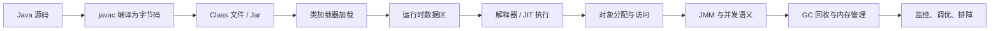
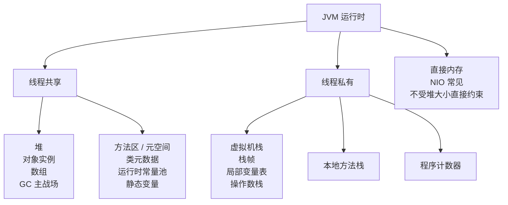

# JVM 深入学习资料

## 资料定位

这份文档不再按“背题”组织，而是按“理解 JVM 如何工作”来组织。目标不是把几个高频问题背熟，而是建立一条完整主线：

`Java 源码 -> 字节码 -> 类加载 -> 运行时数据区 -> 对象创建与访问 -> 执行引擎与 JIT -> JMM -> GC -> 线上排障与调优`

如果这条链路能讲清楚，面试题、性能问题、线上故障，基本都会落到这条主线上。

## 怎么使用这份资料

- 第一轮只看“学习地图”和每章的“必须搞懂”。
- 第二轮结合命令和实验，把抽象概念变成可观察现象。
- 第三轮开始做“从现象反推原因”的练习。
- 面试前只看“高频误区”“排障套路”“自测题”。

## 学习地图


```mermaid
flowchart LR
    A["Java 源码"] --> B["javac 编译为字节码"]
    B --> C["Class 文件 / Jar"]
    C --> D["类加载器加载"]
    D --> E["运行时数据区"]
    E --> F["解释器 / JIT 执行"]
    F --> G["对象分配与访问"]
    G --> H["JMM 与并发语义"]
    H --> I["GC 回收与内存管理"]
    I --> J["监控、调优、排障"]
```

## 必须先分清的 6 组概念

| 概念组                 | 容易混的点     | 正确理解                                  |
| ------------------- | --------- | ------------------------------------- |
| JVM vs JDK vs JRE   | 把三者说成一个东西 | JVM 是执行字节码的虚拟机；JDK 是开发工具包；JRE 是运行环境概念 |
| JVM 内存结构 vs JMM     | 都带“内存”    | 前者讲运行时区域划分，后者讲并发语义                    |
| 栈 vs 堆              | 都在“内存里”   | 栈偏线程执行现场，堆偏对象存储与共享                    |
| 方法区 vs 元空间          | 术语切换后概念混乱 | 方法区是规范层概念，HotSpot 在较新实现里主要落到元空间       |
| Minor GC vs Full GC | 都叫 GC     | 一个偏局部回收，一个偏更大范围回收，停顿影响不同              |
| 内存泄漏 vs OOM         | 当成同义词     | 泄漏更像原因，OOM 更像结果                       |

---

# 1. JVM 总览：先建立全局认知

## 1.1 JVM 到底在做什么

JVM 本质上做三件事：

- 加载字节码，把类变成运行时可用的数据结构。
- 为程序运行提供内存、线程、同步、异常处理等基础能力。
- 把字节码解释或编译成机器指令执行，并在运行过程中做优化。

很多同学学 JVM 时容易碎片化，今天看堆，明天看 GC，后天看锁，最后发现这些点没有串起来。更稳的理解方式是：

1. 程序如何被加载进来。
2. 代码运行时数据放在哪里。
3. 指令如何被执行和优化。
4. 对象什么时候死、怎么回收。
5. 出问题时如何观察和定位。

## 1.2 从 Java 源码到机器码

### 主链路

1. 开发者编写 `.java` 源码。
2. `javac` 编译成 `.class` 字节码。
3. 类加载器把字节码读入 JVM。
4. JVM 校验并构建类的运行时表示。
5. 解释器先执行热点不高的代码。
6. JIT 编译器把热点代码编译成本地机器码。
7. 程序持续运行，JVM 根据运行情况做优化、反优化和 GC。

### 为什么这条链重要

- 讲类加载问题时，你知道问题在“进入 JVM 前后”的哪一层。
- 讲性能问题时，你知道慢可能来自解释执行、JIT 未预热、GC 停顿或锁竞争。
- 讲内存问题时，你知道对象从创建到死亡的完整生命周期。

## 1.3 HotSpot 学习时最该关注什么

虽然 JVM 规范定义了很多行为，但工程上学习 JVM，通常会落到 HotSpot 这条主线。学习时优先关注这些点：

- 运行时数据区怎么划分。
- 类加载器体系怎么工作。
- 对象怎么分配、怎么访问。
- 分层编译和 JIT 怎么做优化。
- 常见 GC 收集器在设计上怎么取舍。
- 工具如何观测线程、堆、类和 GC。

## 1.4 本章必须搞懂

- JVM 不是只有“内存”，它还是一个执行平台。
- 学 JVM 不要一上来背参数，要先有执行链路。
- 后面每一章都在解释这条主链中的一段。

---

# 2. 运行时数据区：程序运行时数据到底放哪

## 2.1 整体结构

### 线程私有

- 程序计数器
- Java 虚拟机栈
- 本地方法栈

### 线程共享

- 堆
- 方法区 / 元空间
- 运行时常量池

还要额外知道一个工程上非常重要但不属于规范运行时数据区的区域：

- 直接内存 `Direct Memory`

## 2.2 一张图看清运行时数据区


```mermaid
flowchart TB
    JVM["JVM 运行时"]
    JVM --> Shared["线程共享"]
    JVM --> Private["线程私有"]
    Shared --> Heap["堆\n对象实例\n数组\nGC 主战场"]
    Shared --> Meta["方法区 / 元空间\n类元数据\n运行时常量池\n静态变量"]
    Private --> Stack["虚拟机栈\n栈帧\n局部变量表\n操作数栈"]
    Private --> Native["本地方法栈"]
    Private --> PC["程序计数器"]
    JVM --> Direct["直接内存\nNIO 常见\n不受堆大小直接约束"]
```

## 2.3 程序计数器

程序计数器可以理解为当前线程下一条将要执行的字节码指令位置指示器。

- 它是线程私有的，因为每个线程执行进度不同。
- 它很小，但必不可少，因为线程切换后要能恢复执行位置。
- 执行 Java 方法时记录字节码位置；执行 Native 方法时，这个值通常没有对应的 Java 字节码位置。

学习重点不在于背定义，而在于知道：

- 为什么它必须线程私有。
- 为什么它通常不是排障重点，但属于运行时结构的基础组成。

## 2.4 虚拟机栈

每个线程创建时都会有自己的虚拟机栈。每次方法调用，都会压入一个栈帧。

### 栈帧包含什么

- 局部变量表
- 操作数栈
- 动态链接
- 方法返回地址
- 一些附加信息

### 为什么栈这么重要

- Java 方法调用链靠它维护。
- 局部变量、方法参数、部分中间计算结果都在这里。
- `StackOverflowError`、递归过深、超长调用链，本质都和这里有关。

### 常见错误

- `StackOverflowError`：通常是递归层级过深、无限递归或单个栈帧太大。
- 某些极端情况下，线程数量过多也会因为栈空间压力导致系统资源问题。

## 2.5 堆

堆是 JVM 中最重要、也是最常被讨论的区域，因为：

- 对象实例通常分配在堆上。
- 数组通常分配在堆上。
- 垃圾回收主要围绕堆展开。
- 大多数内存问题最终会映射到堆行为。

### 为什么对象主要放堆里

因为堆是线程共享区域，便于统一管理对象生命周期。对象可能被多个线程访问，它们的存活时间也往往比单个方法调用更长，因此适合放在堆里交给 GC 管理。

### 堆不等于“所有对象一定都在这里”

学习深入一点后要知道：

- JIT 优化可能让部分对象发生标量替换，不一定真实落到堆上。
- 栈上分配是优化语义的结果，不是语言层显式规则。
- 讨论“对象在堆里”时，通常指一般情况和语义抽象，而不是所有实现细节都绝对不变。

## 2.6 方法区 / 元空间

方法区是 JVM 规范层的概念，主要用于存储：

- 类元数据
- 运行时常量池
- 静态变量
- 即时编译后的代码等

在较新的 HotSpot 实现里，经常用“元空间”来承载这部分元数据，因此学习时要建立这种概念映射。

### 工程上为什么重要

- 动态代理很多时，这里可能膨胀。
- 大量动态生成类、热部署、类加载器泄漏，都可能把问题打到元空间。
- 线上排障不能只盯堆，类元数据也可能出问题。

### 常见异常

- `OutOfMemoryError: Metaspace`

## 2.7 运行时常量池

运行时常量池可以看成类文件常量池在运行期的表现形式，存储：

- 字面量
- 符号引用
- 某些解析后可直接使用的运行时信息

它为什么值得关注：

- 类加载、解析阶段会用到它。
- 字符串常量、符号引用解析、动态链接都和它密切相关。
- 某些面试题会从这里延伸到字符串常量池、`intern()`、类加载解析过程。

## 2.8 直接内存

直接内存不是标准 JVM 运行时数据区的一部分，但工程里非常重要。

- 常见于 NIO、Netty 等场景。
- 它不直接占用 Java 堆，但仍然占用进程内存。
- 因此“堆看起来没满，但进程内存很高”时，不能忘了它。

### 常见误区

- 误以为把堆调大就能解决所有内存问题。
- 只看堆 dump，不看进程总内存、直接内存、线程栈和本地内存。

## 2.9 常见区域与故障映射

| 现象                   | 第一怀疑点             | 常见原因               |
| -------------------- | ----------------- | ------------------ |
| `StackOverflowError` | 栈                 | 递归、循环调用、深调用链       |
| `Java heap space`    | 堆                 | 对象暴涨、泄漏、缓存膨胀、参数过小  |
| `Metaspace` OOM      | 方法区 / 元空间         | 动态类过多、类加载器泄漏       |
| 进程内存高但堆不高            | 直接内存 / 本地内存 / 线程栈 | NIO、线程过多、Native 分配 |

## 2.10 本章必须搞懂

- 栈和堆的边界：一个偏线程执行现场，一个偏对象共享存储。
- 方法区不是“方法代码区”这种粗糙说法。
- 直接内存不在堆里，但会影响整体内存表现。

---

# 3. 类加载机制：类是怎么进入 JVM 的

## 3.1 类加载生命周期

通常可以按这条链理解：

`加载 -> 验证 -> 准备 -> 解析 -> 初始化 -> 使用 -> 卸载`

### 关键理解

- 加载：把字节码读进来，生成类的运行时表示。
- 验证：确认字节码符合规范，避免不安全指令破坏 JVM。
- 准备：为类变量分配内存并赋默认值。
- 解析：把符号引用转换为直接引用。
- 初始化：执行真正的静态赋值和静态代码块。

## 3.2 最容易混的点：准备 vs 初始化

举个例子：

```java
public class Demo {
    static int value = 10;
}
```

- 准备阶段：`value` 先拿到默认值 `0`
- 初始化阶段：执行赋值语句后变成 `10`

这是类加载高频易错点。很多人会把静态变量赋值时机说错。

## 3.3 什么情况下会触发类初始化

常见触发场景：

- `new` 一个类的实例
- 访问类的静态变量，且该变量不是编译期常量
- 调用类的静态方法
- 反射主动使用类
- 初始化子类前先初始化父类
- 启动类被 JVM 指定为主类

学习时要特别注意：

- “被加载”不等于“被初始化”
- “引用到类”也不一定立刻触发初始化

## 3.4 类加载器体系

通常按职责可以理解为：

- 启动类加载器 `Bootstrap ClassLoader`
- 平台类加载器 `Platform ClassLoader`
- 应用类加载器 `Application ClassLoader`
- 自定义类加载器

### 双亲委派模型

加载一个类时，先让父加载器尝试加载；父加载器加载不了，子加载器才自己加载。

### 这样设计的价值

- 避免重复加载
- 避免核心类被随意篡改
- 保持类加载体系的稳定性

## 3.5 为什么自定义类加载器容易出问题

因为类的“身份”不仅由全限定类名决定，还和加载它的类加载器有关。

这会带来几个经典问题：

- 同名类被不同加载器加载后，彼此并不相等。
- `ClassCastException` 可能并不是代码逻辑问题，而是类加载器隔离问题。
- 热部署、插件化、Tomcat、OSGi、Spring Boot fat jar 场景，往往都和类加载边界有关。

## 3.6 类卸载

类卸载并不常见，但理解它很重要。

通常需要同时满足这些条件：

- 该类所有实例都被回收。
- 加载它的类加载器可被回收。
- 对应的 `Class` 对象没有被引用。

因此，工程上很多“元空间涨高”的根因，不是类本身太多，而是类加载器没法回收。

## 3.7 本章必须搞懂

- 类加载是 JVM 把字节码变成可执行运行时结构的入口。
- 双亲委派不是为了“好看”，而是为了一致性和安全性。
- 元空间问题经常和类加载器泄漏绑在一起。

---

# 4. 对象创建、内存布局与访问

## 4.1 对象是怎么创建出来的

一个对象从 `new` 到可用，通常会经过这些步骤：

1. 检查类是否已加载、解析、初始化。
2. 为对象分配内存。
3. 将分配到的内存初始化为零值。
4. 设置对象头。
5. 执行构造方法，按程序语义完成初始化。

## 4.2 对象内存布局

常见可以理解为三部分：

- 对象头
- 实例数据
- 对齐填充

### 对象头里常见有什么

- 哈希码相关信息
- GC 分代年龄
- 锁状态标记
- 指向类元数据的指针

理解对象头很有价值，因为锁升级、偏向锁历史设计、对象身份、哈希码等很多细节都和这里有关。

## 4.3 对象怎么分配

常见分配策略：

- 优先在 Eden 分配
- 大对象可能直接进入老年代或特殊区域，具体和实现及参数有关
- 长期存活对象经过多次回收后晋升
- 线程本地分配缓冲区 `TLAB` 能减少并发分配冲突

## 4.4 对象怎么访问

经典两种思路：

- 句柄访问
- 直接指针访问

HotSpot 常见是直接指针访问，因此对象访问通常更快，但地址变化时由 GC 负责维护引用关系。

## 4.5 引用类型

JVM 学习不要只停留在“强引用”。

Java 里常见有：

- 强引用
- 软引用
- 弱引用
- 虚引用

### 学习重点

- 软引用常用于内存敏感缓存，但不能当作稳定缓存方案。
- 弱引用常用于映射、监听、ThreadLocal 等关联场景的生命周期辅助。
- 虚引用不决定对象存活，更多用于跟踪对象被回收的时机。

## 4.6 本章必须搞懂

- `new` 不是一句简单语法糖，背后有类检查、分配、初始化流程。
- 对象访问和对象布局是理解锁、GC、性能分析的重要基础。
- 引用类型和对象可达性分析紧密相关。

---

# 5. 执行引擎与 JIT：Java 为什么能越来越快

## 5.1 解释执行和即时编译

JVM 不会只靠解释器“慢慢跑”。

- 解释器启动快，适合冷代码。
- JIT 编译器会把热点代码编译为本地机器码。
- 这使得 Java 既有较强可移植性，又能在运行时逐步逼近高性能。

## 5.2 分层编译思想

常见可以理解为：

- 先解释执行，快速启动。
- 监控热点方法和热点循环。
- 对足够热的代码做更高层级优化编译。

这样做的核心价值是：不把大量编译成本浪费在根本不会频繁执行的代码上。

## 5.3 热点探测

JVM 会根据方法调用和循环回边等信息，识别热点代码。

一旦代码足够热，JIT 就可能做这些优化：

- 方法内联
- 逃逸分析
- 标量替换
- 锁消除
- 锁粗化
- 死代码消除
- 公共子表达式消除

## 5.4 为什么性能问题有时“跑一会儿就好了”

因为 JVM 会随着程序运行：

- 收集 profile 信息
- 识别热点路径
- 逐步进行更激进的优化

这也是为什么压测和线上表现、冷启动和预热后的表现，可能差别很大。

## 5.5 反优化与去优化

JIT 的优化不是一劳永逸。

如果 JVM 发现之前做优化时依赖的假设不成立，比如：

- 类型分布变化了
- 内联路径不再稳定
- 分支预测失效

那么 JVM 可能会去优化，回退到更保守的执行路径。

这说明 JVM 是动态优化系统，而不是静态编译一次就结束。

## 5.6 代码缓存和编译观察

学习 JIT 时可以关注：

- 热点方法编译记录
- 内联情况
- 代码缓存使用情况

常用观察方式包括：

```bash
jcmd <pid> Compiler.codecache
jcmd <pid> Compiler.queue
```

不同 JDK 版本的编译日志开关略有差异，学习时知道“JIT 可以被观察”就够了，不必一开始就沉迷参数细节。

## 5.7 本章必须搞懂

- Java 的高性能不是“编译前就全部决定”，而是运行中逐步优化出来的。
- 解释器负责起步，JIT 负责让热点代码更快。
- 逃逸分析、内联、锁优化，是把 JVM 和“只会执行字节码”区分开的关键能力。

---

# 6. Java 内存模型 JMM：并发语义到底怎么保证

## 6.1 JMM 不是一块内存

JMM 不是“又一块运行时内存区域”，而是一套并发语义规范，回答的是：

- 一个线程对共享变量的修改，什么时候对另一个线程可见。
- 编译器和处理器能做哪些重排序。
- 程序如何建立有序性和可见性保证。

一句话记忆：

`JVM 内存结构讲“放哪”，JMM 讲“怎么看得见、顺序能不能保证”。`

## 6.2 三个核心问题

### 可见性

一个线程改了共享变量，另一个线程什么时候能看到。

### 有序性

程序写的顺序和实际执行顺序，是否允许被优化调整。

### 原子性

一个操作是否不可被打断地整体完成。

## 6.3 为什么会出现并发问题

因为真实执行环境里有：

- CPU 缓存
- 写缓冲
- 指令重排
- 编译器优化
- 多核并发执行

如果没有 JMM 这样的规则，Java 并发程序就很难建立可预期行为。

## 6.4 happens-before

happens-before 不是“时间上先发生”，而是“前一个操作的结果，对后一个操作可见，并且执行顺序受到约束”。

常见规则：

- 程序顺序规则
- 监视器锁规则
- `volatile` 变量规则
- 线程启动规则
- 线程终止规则
- 传递性

### 为什么这个概念重要

因为它几乎是所有并发语义问题的统一解释框架。很多问题不必死背结论，只要问自己：

`这两个操作之间有没有建立 happens-before 关系？`

## 6.5 `volatile` 到底解决什么

`volatile` 主要解决：

- 可见性
- 禁止部分重排序

它不解决：

- 复合操作的原子性

因此：

```java
volatile int count = 0;
count++;
```

这里的 `count++` 仍然不是线程安全的，因为它包含读、改、写多个步骤。

## 6.6 `synchronized`、`volatile`、CAS 怎么选

| 手段           | 主要能力       | 优点        | 局限              |
| ------------ | ---------- | --------- | --------------- |
| `volatile`   | 可见性、有序性    | 轻量、语义清晰   | 不能保证复合操作原子性     |
| synchronized | 互斥、原子性、可见性 | 简单直接、语义完整 | 竞争激烈时有阻塞成本      |
| CAS          | 无锁原子更新     | 吞吐高、适合原子类 | ABA、自旋开销、复杂逻辑难写 |

## 6.7 双重检查单例为什么要配合 `volatile`

因为对象创建可能发生重排序。一个典型风险是：

1. 分配内存
2. 把引用赋给变量
3. 再执行构造初始化

如果 2 和 3 被重排，另一个线程可能读到“非空但未初始化完成”的对象。

`volatile` 的价值就在于约束这里的有序性。

## 6.8 本章必须搞懂

- JMM 是规则，不是区域。
- happens-before 是并发语义的主线。
- `volatile` 很重要，但不是万能线程安全方案。

---

# 7. GC：对象死了以后，JVM 怎么回收

## 7.1 为什么需要 GC

Java 不要求开发者手工释放绝大多数对象，但对象不可能无限堆积，所以 JVM 需要自动识别“已经无用”的对象并回收它们占用的空间。

GC 的意义不是只有“方便”：

- 降低手工内存管理复杂度
- 减少悬挂指针、重复释放等问题
- 让对象生命周期管理交给运行时系统统一处理

但 GC 不是免费午餐。它的代价包括：

- Stop-The-World 停顿
- CPU 消耗
- 额外内存占用
- 实现复杂度

## 7.2 如何判断对象是否可回收

主流思路是可达性分析，而不是简单引用计数。

### 为什么不用纯引用计数

因为循环引用会让无用对象仍然彼此计数不为零，导致无法回收。

### 可达性分析怎么理解`

从一组 GC Roots 出发向下搜索，能到达的对象视为存活；不可达对象才有机会被回收。

常见 GC Roots 包括：

- 栈帧中的局部变量引用
- 静态变量引用
- 常量引用
- 本地方法栈中 JNI 引用
- 活跃线程相关引用

## 7.3 对象一定“不可达就立刻死”吗

不是。学习时要知道至少两层语义：

- 不可达只是“可能被回收”的前提
- 最终什么时候回收，取决于 GC 何时执行以及收集器策略

某些对象还可能经历终结相关过程，但工程上更重要的是理解可达性，而不是依赖终结机制。

## 7.4 分代思想

GC 学习的核心假设之一是：

- 大多数对象朝生夕死
- 少数对象会活得很久

因此堆通常按不同生命周期特点做分区管理，这样能让回收更高效。

### 学习重点不是死背区名

而是理解：

- 新生代对象多、死得快，适合频繁快速回收
- 老年代对象少但更稳定，回收更重

## 7.5 常见垃圾回收算法

### 标记-清除

- 优点：实现思路直接
- 问题：会产生内存碎片

### 标记-复制

- 优点：实现简单，分配快
- 问题：需要额外空间做复制

### 标记-整理

- 优点：减少碎片
- 问题：整理成本较高

学习时要知道：现代收集器不是简单只选一种算法，而是会组合使用。

## 7.6 常见收集器应该怎么学

### Serial

- 单线程回收
- 简单直接
- 适合理解基础机制

### Parallel

- 更关注吞吐量
- 常见于批处理、后台任务等更重吞吐场景

### CMS

- 历史上很典型的低停顿思路
- 学它的价值在于理解“并发标记清除”的设计取舍

### G1

- 面向较大堆和服务端场景常见
- 通过分区化管理，试图在吞吐和停顿之间取得平衡
- 学习重点是分区、Remembered Set、预测停顿目标

### ZGC / Shenandoah

- 更强调低停顿
- 学习重点是并发处理、着色指针或转发表等“尽量减少长停顿”的设计思路

初学时最稳的顺序：

`Serial -> Parallel -> CMS -> G1 -> ZGC/Shenandoah`

先理解“为什么需要不同取舍”，再理解更先进收集器的设计。

## 7.7 Minor GC、Major GC、Full GC

这几个词在不同资料里口径并不总完全一致，学习时别死抠术语，要抓住本质：

- 局部回收通常更轻、更频繁
- 涉及更大范围的回收通常更重、停顿更明显

工程上最重要的不是术语争论，而是：

- 回收范围
- 停顿时长
- 业务影响
- 是否有异常趋势

## 7.8 GC 日志应该怎么看

看 GC 日志时，不要只盯“发生了几次 GC”，更重要的是看：

- 回收前后堆占用
- 停顿时间
- 回收频率
- 老年代 / 整体容量变化趋势
- 晋升是否过快
- 是否有明显回收效果变差

一个成熟的排查视角是：

`单次回收效果 + 一段时间趋势 + 业务时间点对齐`

## 7.9 Full GC 频繁的常见原因

- 对象创建速度过快
- 对象生命周期异常，晋升过快
- 缓存或集合长期膨胀
- 内存泄漏
- 参数配置不合理
- 类元数据或直接内存压力间接影响整体行为

## 7.10 本章必须搞懂

- GC 核心是“识别死亡对象并回收空间”，但难点在于低成本完成。
- 学 GC 不要只背收集器名字，要理解背后的设计取舍。
- 频繁 Full GC 不是结论，而是现象。

---

# 8. JVM 工具链：把抽象概念变成可观察现象

## 8.1 最小工具集

| 工具       | 最常用途       | 学习重点          |
| -------- | ---------- | ------------- |
| `jps`    | 看 Java 进程  | 先找到目标进程       |
| `jstat`  | 看 GC 和内存趋势 | 学会观察回收频率和容量变化 |
| `jstack` | 抓线程栈       | CPU 高、死锁、阻塞分析 |
| `jmap`   | 堆摘要、dump   | 内存高、对象分布异常    |
| `jcmd`   | 多功能诊断入口    | 现代 JDK 中非常实用  |
| `jhsdb`  | 更底层调试      | 需要时再深入        |

## 8.2 为什么更推荐把 `jcmd` 学扎实

因为它往往能统一完成很多诊断任务，比如：

```bash
jcmd <pid> VM.flags
jcmd <pid> VM.system_properties
jcmd <pid> GC.heap_info
jcmd <pid> GC.class_histogram
jcmd <pid> Thread.print
```

它非常适合做“先快速建立问题画像”这一步。

## 8.3 观察堆和对象分布

学习堆问题时，至少要会两类观察：

- 趋势观察：堆是不是持续上涨，GC 后能不能回落
- 分布观察：到底是什么对象在占内存

示例：

```bash
jstat -gcutil <pid> 1000
jcmd <pid> GC.class_histogram
```

## 8.4 观察线程问题

CPU 高、线程卡死、死锁排查，线程栈几乎是必经之路：

```bash
jstack <pid>
jcmd <pid> Thread.print
```

学习线程栈时重点不是看懂每一行，而是先学会识别：

- RUNNABLE 热线程
- BLOCKED 锁竞争
- WAITING / TIMED_WAITING 等待
- 死锁线索

## 8.5 观察类和类加载

类加载问题、元空间问题，常见关注点包括：

- 当前加载类总数
- 类加载 / 卸载趋势
- 某个类加载器下挂了多少类

可以从这些命令入手：

```bash
jcmd <pid> VM.classloader_stats
jcmd <pid> GC.class_histogram
```

## 8.6 本章必须搞懂

- 工具不是背命令，而是服务于“建立画像 -> 缩小范围 -> 找根因”。
- 线程、堆、类、GC 这四条线要能分别观察。
- 学 JVM 不做实验，很容易一直停留在概念层。

---

# 9. 线上排障：从症状倒推 JVM 根因

## 9.1 一条通用排障主线

线上遇到 JVM 问题，最稳的路径通常是：

`现象 -> 指标 -> 线程 / 堆 / GC / 类 -> 代码或配置根因`

而不是：

`看见异常 -> 直接猜泄漏或改参数`

## 9.2 CPU 高怎么排

### 第一观察点

- 是否是 Java 进程本身高 CPU
- 是否是少数线程打满
- 是否和 GC 时间点重合

### 最小排查步骤

1. 确认进程。
2. 抓热点线程。
3. 拉线程栈。
4. 判断是死循环、自旋、锁竞争、频繁异常、JIT 编译抖动还是 GC 抢占 CPU。

### 常见根因

- 业务代码死循环
- CAS 自旋过重
- 锁竞争激烈
- 对象创建过快导致 GC 压力大
- 序列化、正则、JSON、反射等热点代码异常耗 CPU

## 9.3 内存高怎么排

### 先分清两类情况

- 短期峰值
- 持续增长

### 最小排查步骤

1. 看堆是否持续上涨。
2. 看 GC 后能否明显回落。
3. 看大对象或热点对象分布。
4. 看是缓存、集合、`ThreadLocal`、消息积压还是泄漏。
5. 不够时再 dump 堆做离线分析。

### 常见根因

- 缓存策略设计不合理
- 集合只增不减
- 消费端变慢导致对象堆积
- `ThreadLocal` 没清
- 监听器、回调、静态集合持有引用

## 9.4 RT 抖动怎么排

RT 抖动很容易被误判成“JVM 参数不行”，但它常常是多因素叠加。

### 第一观察点

- GC 停顿
- 线程池堆积
- 锁等待
- 下游依赖耗时

### 最小排查步骤

1. 把 RT 时间点和 GC 时间点对齐。
2. 看线程池队列、活跃线程、拒绝情况。
3. 看线程栈里有没有锁竞争或阻塞。
4. 再判断是不是 JVM 是根因，还是只是被业务压力放大。

## 9.5 Full GC 频繁怎么排

最稳的思路：

1. 看频率、停顿时长、业务影响。
2. 看堆占用趋势，特别是老年代是否持续走高。
3. 看对象分布和增长最快的对象类型。
4. 判断是泄漏、缓存膨胀、生命周期异常还是参数不匹配。
5. 必要时结合堆 dump、GC 日志、代码热点一起看。

### 一个常见误区

不要一看到 Full GC 就立刻下结论“内存泄漏”。很多时候只是：

- 流量模型变了
- 短命对象太多
- 缓存膨胀
- 晋升过快
- 参数和业务模型不匹配

## 9.6 内存泄漏 vs 内存溢出

### 内存泄漏

本该失去引用的对象，还被某些引用链持有，导致长期无法回收。

### 内存溢出

申请内存时已经没有足够空间，最终表现为 `OutOfMemoryError`。

### 两者关系

- 泄漏常常会导致溢出
- 溢出不一定来自泄漏，也可能来自峰值流量、大对象或配置过小

## 9.7 线上排障时最容易踩的坑

- 不先建立画像，直接改 JVM 参数
- 只看一个指标，不看趋势
- 只盯堆，不看线程、类加载、直接内存
- 一上来就 dump，大量耗时但问题边界仍不清晰
- 把业务慢全归因给 JVM

## 9.8 本章必须搞懂

- 排障的核心是顺序感，不是命令越多越厉害。
- JVM 视角必须和线程池、业务代码、下游依赖结合。
- 一个稳定的排障框架，远比死记工具命令更有价值。

---

# 10. 实验路线：把 JVM 学成“能观察、能解释、能定位”

## 10.1 实验一：观察栈溢出

目标：理解栈帧和 `StackOverflowError`

```java
public class StackOverflowDemo {
    public static void main(String[] args) {
        dive();
    }

    static void dive() {
        dive();
    }
}
```

观察点：

- 程序很快抛出 `StackOverflowError`
- 说明栈空间与递归深度直接相关

## 10.2 实验二：观察堆对象增长

目标：理解堆上涨、GC 后回落与真正泄漏的差别

```java
import java.util.ArrayList;
import java.util.List;

public class HeapGrowDemo {
    static List<byte[]> list = new ArrayList<>();

    public static void main(String[] args) throws Exception {
        while (true) {
            list.add(new byte[1024 * 1024]);
            Thread.sleep(200);
        }
    }
}
```

观察点：

- 用 `jstat` 看堆变化趋势
- 用 `jcmd <pid> GC.class_histogram` 看对象分布
- 理解“静态集合持有引用”为什么容易形成泄漏模型

## 10.3 实验三：观察类初始化

目标：区分“加载”和“初始化”

```java
public class InitDemo {
    static {
        System.out.println("InitDemo init");
    }

    public static int value = 10;
}
```

配合不同调用方式观察：

- 只拿 `InitDemo.class`
- 读取静态字段
- 调用静态方法
- 通过反射加载

观察点：

- 哪些操作会触发初始化
- 哪些只是拿到类元信息

## 10.4 实验四：观察 `volatile` 可见性

目标：理解 `volatile` 解决的是可见性，不是复合原子性

```java
public class VolatileDemo {
    static volatile boolean running = true;

    public static void main(String[] args) throws Exception {
        new Thread(() -> {
            while (running) {
            }
            System.out.println("stopped");
        }).start();

        Thread.sleep(1000);
        running = false;
    }
}
```

观察点：

- 没有 `volatile` 时，工作线程可能长时间感知不到变化
- 加上 `volatile` 后，可见性建立

## 10.5 实验五：观察 GC 日志

目标：把“GC 发生过”升级为“看懂 GC 为什么发生、效果如何”

建议观察内容：

- 回收前后占用变化
- 单次停顿时间
- 年轻代和老年代趋势
- 是否存在晋升压力

## 10.6 实验六：观察类加载器隔离

目标：理解“类身份 = 类名 + 类加载器”

可以通过两个不同的自定义类加载器分别加载同一个类，观察：

- 两个 `Class` 对象不相等
- 即使全限定类名一样，也不能直接互转

## 10.7 实验路线建议

- 先做栈、堆、类加载三个基础实验
- 再做 `volatile` 和 GC 日志实验
- 最后做类加载器隔离和实际排障演练

---

# 11. 学习顺序建议：从入门到深入

## 第一阶段：先把全景图立住

学习目标：

- 分清 JVM、JDK、JRE
- 分清运行时数据区
- 理解类加载主流程

建议重点：

- 第 1 章
- 第 2 章
- 第 3 章

## 第二阶段：把对象和执行过程学透

学习目标：

- 理解对象创建、内存布局、访问方式
- 理解解释器、JIT、热点编译

建议重点：

- 第 4 章
- 第 5 章

## 第三阶段：进入并发和 GC

学习目标：

- 分清 JMM、happens-before、`volatile`
- 理解可达性分析、分代思想、收集器取舍

建议重点：

- 第 6 章
- 第 7 章

## 第四阶段：进入工具与排障

学习目标：

- 能用最小工具链建立画像
- 能从 CPU、内存、RT、Full GC 四条线排查

建议重点：

- 第 8 章
- 第 9 章
- 第 10 章

## 第五阶段：回到面试表达

当上面都学完后，再去回答面试题，你会发现很多答案会自然长出来：

- 不只会说定义
- 能解释为什么
- 能举线上场景
- 能说排查顺序和工具使用

---

# 12. 高频误区清单

- 把 JMM 当成 JVM 的某块内存区域。
- 把方法区理解成“方法代码存放区”。
- 认为所有对象都必然真实落在堆上。
- 认为 `volatile` 能解决所有线程安全问题。
- 认为 Full GC 频繁就一定是内存泄漏。
- 认为堆没满就说明没有内存问题。
- 认为调大堆就一定能提升性能。
- 认为 JVM 调优就是背一堆参数。
- 认为 CPU 高一定是业务死循环，不可能是 GC 或锁问题。

---

# 13. 面试前速记版

## 13.1 一句话记忆

- JVM 内存结构看“区域划分”，JMM 看“并发语义”。
- 栈是线程执行现场，堆是对象共享存储。
- 类加载的关键卡点是“准备”和“初始化”。
- JIT 让热点代码越来越快。
- GC 的核心是识别不可达对象并低成本回收。
- 排障先看现象，再看线程、堆、GC、类。

## 13.2 高频问答浓缩

### JVM 和 JMM 的区别

一个讲运行时区域划分，一个讲多线程下可见性和有序性。

### `volatile` 解决什么

解决可见性和部分有序性，不解决复合操作原子性。

### Full GC 频繁怎么排

先看趋势和业务影响，再看对象分布和老年代增长，最后判断泄漏、缓存、生命周期或参数问题。

### 内存泄漏和 OOM 的区别

泄漏更像原因，OOM 更像结果。

---

# 14. 自测题

## 基础理解

- 为什么程序计数器必须线程私有？
- 为什么虚拟机栈不需要像堆那样依赖 GC 统一管理？
- 方法区、元空间、运行时常量池之间是什么关系？

## 类加载

- 准备阶段和初始化阶段最大的区别是什么？
- 为什么双亲委派能避免核心类被篡改？
- 为什么同名类会出现 `ClassCastException`？

## 对象与执行

- 对象从 `new` 到可用经过哪些关键步骤？
- 什么是逃逸分析？它和性能优化有什么关系？
- 为什么 Java 程序可能“跑一会儿更快”？

## JMM

- happens-before 解决的核心问题是什么？
- 为什么 `volatile` 不能保证 `count++` 线程安全？
- 双重检查单例为什么必须配合 `volatile`？

## GC

- 为什么纯引用计数不能作为主流垃圾判断方案？
- G1 的学习重点是什么？
- Full GC 频繁但堆 dump 不明显，可能有哪些原因？

## 排障

- CPU 高时，第一步应该看什么？
- 堆持续上涨但 GC 后能明显回落，说明什么？
- 进程内存很高但堆不高，还该查哪些方向？

---

# 15. 推荐深入路线

## 书籍方向

- 先读 JVM 总览和运行时结构，再读类加载、执行引擎、GC。
- 不要一开始就陷进所有参数和实现细节。
- 先建立骨架，再读源码和日志。

## 源码方向

如果你想继续深挖，可以沿这些方向展开：

- 类加载器与类元数据结构
- 对象头和锁实现
- JIT 编译与内联优化
- G1 / ZGC 的核心数据结构

## 工程方向

真正把 JVM 学扎实，最后一定会回到三个问题：

- 我能不能解释程序为什么这样运行？
- 我能不能通过工具观察到这种运行？
- 我能不能在故障现场快速收缩范围？

如果这三个问题都能稳定回答，JVM 就不再只是面试题库，而会变成你的工程底层能力。
